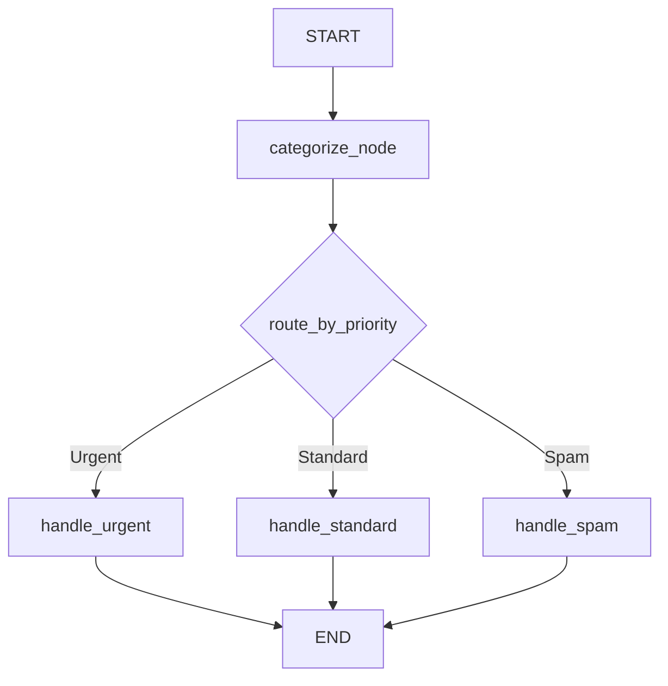

# 🎫 Customer Support Ticket Classifier

This project uses **LangGraph** and **Gemini** (or GPT-4o) to automatically classify support tickets, assign priority, and draft appropriate responses based on the priority level.

## 🏗️ Workflow Diagram



## 🛠️ Tech Stack

- **Python 3**
- **LangGraph & LangChain**: For agentic routing and state management.
- **Google Gemini 1.5 Flash**: (Configurable to GPT-4o) for classification and drafting.
- **Gradio**: For a clean, interactive user interface.
- **Pandas**: For handling the ticket dataset.

## 🚀 Getting Started

1. **Install Dependencies**:
   ```bash
   pip install -r requirements.txt
   ```

2. **Setup Environment**:
   Create a `.env` file with your API keys:
   ```env
   GOOGLE_API_KEY=your_key_here
   ```

3. **Run the Gradio App**:
   ```bash
   python app.py
   ```

4. **Run Batch Processing**:
   To process all 25 tickets in the sample CSV:
   ```bash
   python batch_process.py
   ```

## 📄 File Structure

- `agent.py`: Contains the LangGraph definition, nodes, and routing logic.
- `app.py`: Gradio UI implementation.
- `batch_process.py`: Script to process the entire `tickets.csv`.
- `tickets.csv`: Sample dataset of support tickets.
- `requirements.txt`: Python dependencies.
