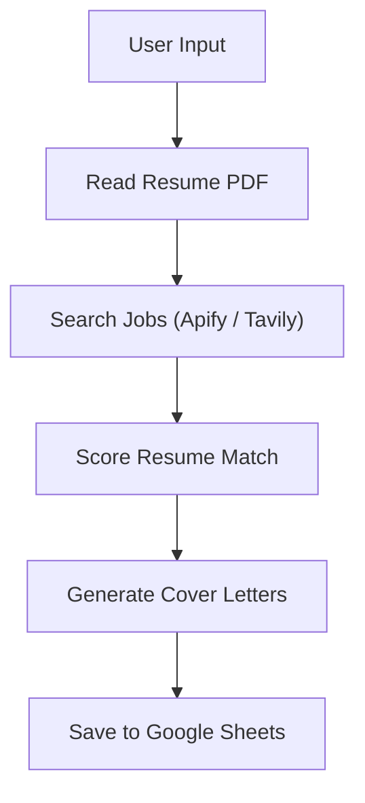

# AI Job Application Agent

## Overview
Autonomous agent that searches jobs, scores resume fit, and generates tailored cover letters using LangChain.  
It takes a resume plus a prompt like `Data Analyst jobs in Bangalore` and saves ranked results to Google Sheets.

## Demo
- Demo input: `Find me Data Analyst jobs in Bangalore`
- Demo output: ranked job matches, generated cover letters, and saved rows in Google Sheets
- Sample run output: [sample_output/agent_run.json](/Volumes/SSD/tutorial/Full%20Stack%20Agentic%20AI%20Engineering%20/Code%20Work/job-application-agent/sample_output/agent_run.json:1)
- Sample cover letters:
  - [cover_letter_1.txt](/Volumes/SSD/tutorial/Full%20Stack%20Agentic%20AI%20Engineering%20/Code%20Work/job-application-agent/sample_output/cover_letter_1.txt:1)
  - [cover_letter_2.txt](/Volumes/SSD/tutorial/Full%20Stack%20Agentic%20AI%20Engineering%20/Code%20Work/job-application-agent/sample_output/cover_letter_2.txt:1)

Add your own:
- `sample_output/demo.gif`
- Demo video link
- Blog post link

## Features
- Job scraping via Apify with Tavily fallback for search resilience
- Resume parsing from PDF
- Match scoring against job keywords
- AI-generated cover letters
- Auto logging to Google Sheets
- Ollama or OpenAI model switch for development and testing

## Architecture
```text
User Input
   ↓
Search Jobs (Apify / Tavily)
   ↓
Score Match
   ↓
Generate Cover Letter (LLM)
   ↓
Save to Google Sheets
```



## Tech Stack
- LangChain
- Python
- Apify
- Tavily
- Google Sheets API
- OpenAI API / Ollama

## Setup Instructions
```bash
git clone <your-repo-url>
cd job-application-agent
pip install -r requirements.txt
```

Create `.env` from `.env.example`:

```env
MODEL_PROVIDER=ollama

OPENAI_API_KEY=
OPENAI_MODEL=gpt-4o-mini

OLLAMA_BASE_URL=http://localhost:11434
OLLAMA_MODEL=llama3.2:latest

APIFY_API_TOKEN=
APIFY_ACTOR_ID=bebity/linkedin-jobs-scraper

TAVILY_API_KEY=

GOOGLE_SERVICE_ACCOUNT_FILE=/absolute/path/to/service-account.json
GOOGLE_SHEET_ID=
GOOGLE_SHEET_WORKSHEET=Job Matches
```

Google Sheets notes:
- Share the target sheet with the service account email
- The app writes to the `Job Matches` tab by default
- If the tab does not exist, it will be created or the first blank sheet will be renamed

## Usage
Start the agent:

```bash
python main.py \
  --resume "/absolute/path/to/resume.pdf" \
  --query "Find Data Analyst jobs in Bangalore"
```

Example input:
```text
Find Data Analyst jobs in Bangalore
```

## Project Structure
```text
project/
│── main.py
│── agents/
│   └── job_application_agent.py
│── tools/
│   ├── read_resume.py
│   ├── search_jobs.py
│   ├── score_match.py
│   ├── write_cover_letter.py
│   └── save_to_sheet.py
│── utils/
│   ├── config.py
│   ├── google_sheets.py
│   └── parsers.py
│── app/
│   ├── agent.py
│   ├── pipeline.py
│   ├── parsers.py
│   ├── services/
│   └── tools/
│── sample_output/
│   ├── agent_run.json
│   ├── cover_letter_1.txt
│   ├── cover_letter_2.txt
│   └── screenshots/
│── requirements.txt
│── .env.example
│── .gitignore
│── LICENSE
│── README.md
```

## Sample Outputs
- Terminal output: [agent_run.json](/Volumes/SSD/tutorial/Full%20Stack%20Agentic%20AI%20Engineering%20/Code%20Work/job-application-agent/sample_output/agent_run.json:1)
- Cover letter sample 1: [cover_letter_1.txt](/Volumes/SSD/tutorial/Full%20Stack%20Agentic%20AI%20Engineering%20/Code%20Work/job-application-agent/sample_output/cover_letter_1.txt:1)
- Cover letter sample 2: [cover_letter_2.txt](/Volumes/SSD/tutorial/Full%20Stack%20Agentic%20AI%20Engineering%20/Code%20Work/job-application-agent/sample_output/cover_letter_2.txt:1)

## Screenshots
- `sample_output/screenshots/agent-running.png`
- `sample_output/screenshots/output-sheet.png`
- `sample_output/screenshots/logs.png`

Those screenshot files are reserved in the repo layout, but they were not auto-captured in this environment.

## Notes
- The deterministic pipeline is the production path because it is more reliable with external tools and file paths.
- The optional ReAct trace is kept for experimentation, not as the primary execution path.
- Apify may require a paid actor depending on the selected actor and your account plan.

## License
MIT
